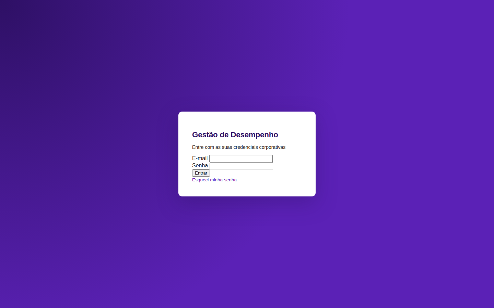
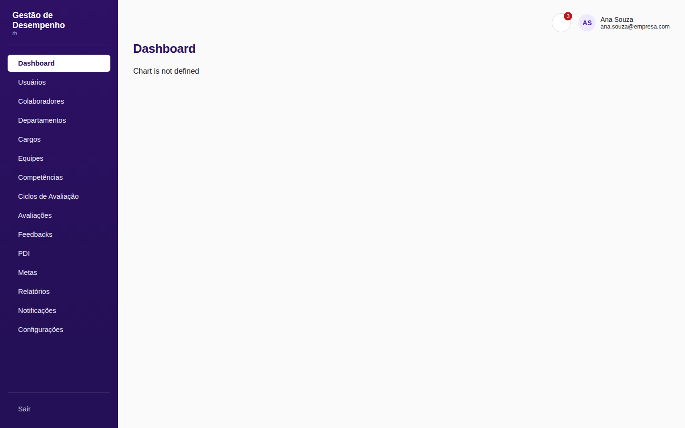
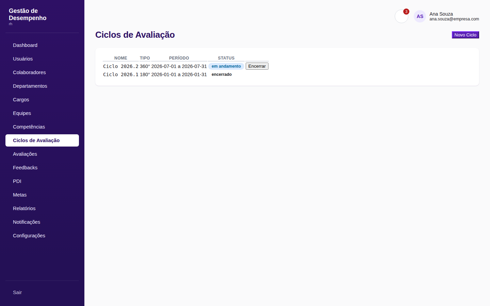
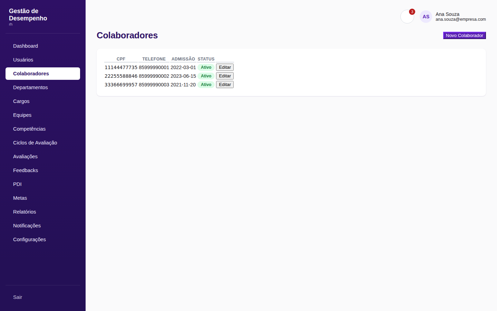

<div align="center">

# 📊 Sistema de Gestão de Desempenho Corporativo

**Plataforma SaaS multi-tenant para gestão de desempenho de RH** — ciclos de avaliação 90°/180°/360°, feedbacks, PDIs, metas e dashboards gerenciais.

Node.js · Express · PostgreSQL (Supabase) · Bootstrap 5 · JavaScript ES6

[Arquitetura](#-arquitetura) · [Funcionalidades](#-funcionalidades) · [Screenshots](#-screenshots) · [Como rodar](#-como-rodar-localmente) · [Decisões técnicas](#-decisões-técnicas-que-vale-a-pena-ler)

</div>

---

## 💡 Sobre o projeto

Sistema completo de gestão de desempenho corporativo, construído do zero como um produto **multiempresa (multi-tenant)**: várias empresas clientes compartilham a mesma infraestrutura, com isolamento total de dados garantido em nível de aplicação e reforçado por triggers no banco.

O projeto cobre o ciclo inteiro de gestão de desempenho: cadastro de colaboradores e estrutura organizacional → definição de competências → execução de ciclos de avaliação (auto/líder/pares/subordinados) → feedback → PDI → metas → dashboard → relatórios exportáveis.

## 🏗️ Arquitetura

Arquitetura em camadas estrita no backend, com separação clara de responsabilidades:

```
Routes → Middlewares (auth → empresa → permissão) → Controllers → Services → Validators → Models → Supabase
```

- **6 perfis de usuário** (Administrador Geral, Administrador da Empresa, RH, Gestor, Líder, Colaborador), cada um com permissões próprias validadas em duas camadas: `permissaoMiddleware` (perfil × rota) e regras finas na camada de Service (ex: "Líder só avalia sua própria equipe").
- **Isolamento multiempresa** aplicado automaticamente em toda consulta de negócio via um utilitário central (`escopoEmpresa.js`), auditado manualmente em 100% dos 17 Models do projeto.
- **Motor de avaliação 360°** que gera automaticamente autoavaliação, avaliação do líder, avaliação de pares e avaliação ascendente (subordinado → líder), a partir da hierarquia organizacional real (`lider_id`/`gestor_id`).
- **Auditoria completa**: toda operação sensível (login, criação, alteração, exclusão, falha de autorização) é registrada com usuário, IP, data/hora e tabela afetada.

## ✅ Funcionalidades

| Módulo | Destaques |
|---|---|
| Autenticação | Login, logout, recuperação/alteração de senha via Supabase Auth |
| Estrutura organizacional | Empresas, usuários, departamentos, cargos, equipes, colaboradores |
| Competências | Categorias e competências com peso, usadas no cálculo de nota final |
| Avaliação de desempenho | Ciclos 90°/180°/360° com geração automática de avaliações e cálculo de nota final via trigger no banco |
| Feedback & PDI | Escopo hierárquico (líder/gestor só agem sobre sua própria equipe) |
| Metas & Indicadores | Atualização de progresso com promoção/reversão automática de status |
| Notificações | Disparo automático em 5 eventos-chave do sistema |
| Dashboard | Médias por departamento/líder, ranking, competências críticas, evolução mensal |
| Relatórios | Exportação em PDF e Excel |
| Auditoria | Consulta de logs com escopo por perfil |

## 📸 Screenshots

<table>
<tr>
<td width="50%"></td>
<td width="50%"></td>
</tr>
<tr>
<td align="center"><em>Login</em></td>
<td align="center"><em>Dashboard com indicadores consolidados</em></td>
</tr>
<tr>
<td width="50%"></td>
<td width="50%"></td>
</tr>
<tr>
<td align="center"><em>Ciclos de avaliação (abrir/encerrar)</em></td>
<td align="center"><em>Cadastro de colaboradores</em></td>
</tr>
</table>

> Telas renderizadas com dados de demonstração para fins de portfólio.

## 🚀 Como rodar localmente

```bash
# 1. Clone o repositório
git clone https://github.com/SEU-USUARIO/gestao-desempenho-rh.git
cd gestao-desempenho-rh

# 2. Rode o script SQL em docs/modelagem-banco.sql no SQL Editor do seu projeto Supabase

# 3. Configure e suba o backend
cd backend
npm install
cp .env.example .env   # preencha com suas credenciais do Supabase
npm run dev

# 4. Sirva o frontend (em outro terminal)
cd ../frontend
python3 -m http.server 5500
```

Acesse `http://localhost:5500`. Instruções detalhadas (variáveis de ambiente, criação de usuário de teste, testes de cada endpoint) estão no [README técnico completo](README.md).

## 🧠 Decisões técnicas que vale a pena ler

**Por que isolamento por `empresa_id` em vez de schema-per-tenant?** Com dezenas/centenas de empresas clientes, um schema por tenant vira um pesadelo operacional (migrations multiplicadas, monitoramento fragmentado). Optei por banco compartilhado com isolamento em nível de aplicação — mais simples de operar em escala, desde que o filtro seja aplicado de forma disciplinada. Por isso centralizei essa regra em um único utilitário (`escopoEmpresa.js`) usado por todos os Models, em vez de deixar cada consulta reimplementar o filtro manualmente.

**Por que `nota_final` é calculada por uma trigger no banco, e não pela aplicação?** Porque a nota depende de todos os itens de avaliação (`avaliacao_itens`), que podem ser inseridos em momentos diferentes por avaliadores diferentes. Calcular na trigger garante que o valor esteja **sempre consistente**, mesmo se alguém escrever direto no banco (migrations, scripts administrativos) — a aplicação nunca escreve esse campo diretamente.

**Como funciona o motor de avaliação 360°?** O SAD original não detalhava a semântica exata dos tipos de avaliação, então documentei explicitamente a convenção adotada no código: cada tipo representa a *relação* entre avaliador e avaliado (autoavaliação, líder→colaborador, pares do mesmo líder, subordinado→líder). A partir disso, abrir um ciclo 360° percorre a hierarquia organizacional (`lider_id`) e gera automaticamente o conjunto correto de avaliações para cada colaborador ativo — testei essa lógica isoladamente com uma hierarquia sintética de 6 pessoas antes de integrar ao banco.

## 🛠️ Stack

**Backend:** Node.js, Express, Supabase (PostgreSQL + Auth + Storage), Helmet, CORS, express-rate-limit, pdfkit, exceljs
**Frontend:** HTML5, CSS3, JavaScript ES6 (sem frameworks), Bootstrap 5
**Arquitetura:** REST API em camadas (Routes/Middlewares/Controllers/Services/Validators/Models), RBAC, multi-tenancy

---

<div align="center">
<sub>Projeto desenvolvido como estudo aprofundado de arquitetura backend, multi-tenancy e design de permissões em sistemas corporativos.</sub>
</div>
